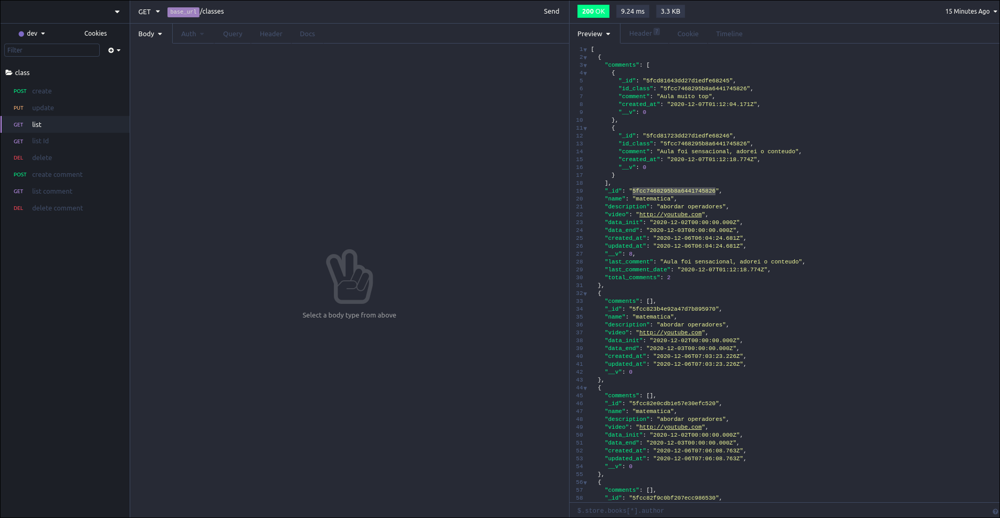

# Classes (API)

<p align="center">
  
</p>


## :rocket: Sobre o desafio

Aplicação para criar aulas e comentários seguindo endpoints estipulados, utilizando banco não relacional Mongodb e adicionando algum tipo de teste.

## 💻 Tecnologias utilizadas

* [Node.js](https://nodejs.org/en/)
* [Express](https://expressjs.com/pt-br/)
* [Nodemon]https://nodemon.io/
* [Mongoose](https://mongoosejs.com/)
* [Jest & Supertest](https://jestjs.io/)

### Rotas da aplicação

- **`POST /classes`**: A rota de receber a estrutura a baixo:

```json
{
  "name": "matematica",
  "description": "abordar operadores",
  "video": "http://youtube.com",
  "data_init": "2020-12-02",
  "data_end": "2020-12-03"
}
```

- **`GET /classes`**: Essa rota deve retornar todas as aulas cadastradas, os comentários que foram feitos referência a ela e o total de comentários que à aula tem, além de trazer um campo chamado ​ last_comment​ , que é o último comentário que a aula recebeu e o campo ​ last_comment_date que é a data que foi feito este comentário. O formato deve seguir esse padrão:

```json
  {
    "comments": [
      {
        "_id": "5fcd81643dd27d1edfe68245",
        "id_class": "5fcc7468295b8a6441745826",
        "comment": "Aula muito top",
        "created_at": "2020-12-07T01:12:04.171Z",
        "__v": 0
      },
      {
        "_id": "5fcd81723dd27d1edfe68246",
        "id_class": "5fcc7468295b8a6441745826",
        "comment": "Aula foi sensacional, adorei o conteudo",
        "created_at": "2020-12-07T01:12:18.774Z",
        "__v": 0
      }
    ],
    "_id": "5fcc7468295b8a6441745826",
    "name": "matematica",
    "description": "abordar operadores",
    "video": "http://youtube.com",
    "data_init": "2020-12-02T00:00:00.000Z",
    "data_end": "2020-12-03T00:00:00.000Z",
    "created_at": "2020-12-06T06:04:24.681Z",
    "updated_at": "2020-12-06T06:04:24.681Z",
    "__v": 8,
    "last_comment": "Aula foi sensacional, adorei o conteudo",
    "last_comment_date": "2020-12-07T01:12:18.774Z",
    "total_comments": 2
  }
  ```

- **`GET /classes/:id`**: Obter detalhes de uma aula pelo id, e no detalhe de uma aula, trazer os últimos 3 comentários dela em um
objeto dentro do próprio JSON, como o exemplo abaixo:

```json
{
  "name": "Aula xyz",
  "comments": [ "array com os três comentários" ]
}
```

- **`PUT /classes`**: Rota para atualizar aula, passando os dados que deseja alterar especificando o id:

```json
{
  "id_class": "5fcc7468295b8a6441745826",
  "name": "portugues",
  "description": "interpretação de text",
  "video": "http://youtube.com",
  "data_init": "2020-12-02",
  "data_end": "2020-12-03"
}
```

- **`DELETE /classes/:id`**: Excluir o cadastro de uma aula pelo id

- **`POST /classes/comments`**: Cadastrar um comentário para uma aula específica e atualizar o contador de comentários da aula:

```json
{
  "id_class": "5fcc7468295b8a6441745826",
  "comment": "Aula foi sensacional, adorei o conteudo"
}
```

- **`GET /classes/comments`**: Listar todos os comentários de uma aula

- **`DELETE /classes/comments/:id`**: Excluir um comentário pelo id

### Específicação dos testes

- **`should create a new Class`**: Para que esse teste passe, a aplicação deve permitir que uma classe seja criada, e retorne um json com a transação criado.

- **`should list Class`**: Para que esse teste passe, a aplicação deve permitir que a classe seja listada retornando um status 200.

- **`It should respond with an class id`**: Para que esse teste passe, sua aplicação deve permitir que uma classe seja listada pelo id, e retorne um json com os dados especificados.
